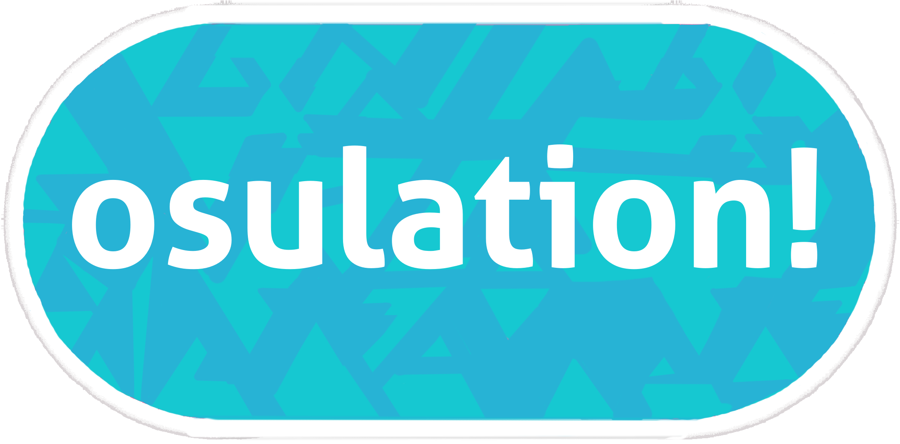
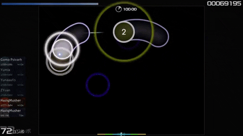

<!-- PROJECT LOGO -->
 

    

  <h1 align="center">osulation!</h1>

  

    hand-driven osu!
     
    <a href="https://devpost.com/software/osulation"><strong>Devpost »</strong></a>
     
     
    <a href="https://www.linkedin.com/in/cindy-li-569a30187/">Cindy Li</a>
    ·
    <a href="https://www.linkedin.com/in/2023cyang/">Cindy Yang</a>
    ·
    <a href="https://www.linkedin.com/in/elise-yz/">Elise Zhu</a>
    ·
    <a href="https://www.linkedin.com/in/selina-sun-550301227/">Selina Sun</a>
  

<!-- TABLE OF CONTENTS -->

  
Table of Contents

  <ol>
    <li>
      <a href="#about-the-project">About The Project</a>
      <ul>
        <li><a href="#built-with">Built With</a></li>
      </ul>
    </li>
    <li>
      <a href="#technologies">Technologies</a>
      <ul>
        <li><a href="#roboflow">Roboflow</a></li>
        <li><a href="#streamlit">Streamlit</a></li>
        <li><a href="#matlab">Matlab</a></li>
        <li><a href="#optimizations">Optimizations</a></li>
      </ul>
    </li>
    <li><a href="#contact">Contact</a></li>
    <li><a href="#acknowledgments">Acknowledgments</a></li>
  </ol>

<!-- ABOUT THE PROJECT -->
## About The Project

If the Wii taught us anything, it’s that flailing your arms around is fun. So, we’ve built a pipeline that tracks your hand and arm movements in real-time, converting your moving limbs into precise game controls!

This project is not only a fun way to play games, but it also has a wide range of applications in various fields:

- 🎨 Gesture-controlled digital painting or air-drawing.

- 🧠 Gamifying controlled arm and hand movements are great for physical therapy exercises, especially in patients recovering from injuries.

- 🤖 Control robots or drones with the flick of a wrist!

**Why Osu! though?**

Because if our algorithm can handle tracking hyper-precise arm movements at ridiculous speeds, it can handle pretty much anything. Also, Osu! is a fun game that we're all abysmal at, so we figured we'd make it a little easier for ourselves.

### Built With

[![Roboflow][Roboflow]][Roboflow-url]
[![Mediapipe][Mediapipe]][Mediapipe-url]
[![Python][Python]][Python-url]
[![Streamlit][Streamlit]][Streamlit-url] 
[![Wolfram][Wolfram]][Wolfram-url]

(<a href="#readme-top">back to top</a>)

<!-- GETTING STARTED -->
## Technologies

### Roboflow

To train our model, we used Roboflow, a platform that allows us to easily train models on custom datasets. We combined two datasets hosted on Roboflow, the [Palm Detection Dataset](https://universe.roboflow.com/dasfsahfas/palm-detection-c3si5) and a [Hand Pose Dataset](https://universe.roboflow.com/vision-no7cd/vision-ni0je), to create a dataset that could be used to train a model to detect hands and their poses, specifically fists and open palms. We then used Roboflow to train a model on this dataset, achieving an mAP of 0.995 over 200 epochs.

### Streamlit

We used Streamlit to provide users with an easy way to launch and interact with our application, offering a clear and elegant showcase of our project. Streamlit enabled us to seamlessly present key features, our team, tech stack, gameplay instructions, and data visualizations that were critical in selecting the best model version. Its simplicity allowed us to create a clean and intuitive UI, ensuring a smooth user experience while maintaining a professional and polished look.

### Matlab

To determine the best version of our model, we conducted a comprehensive data collection process and leveraged Matlab for in-depth analysis. This allowed us to rigorously compare performance metrics across different iterations, ensuring that we selected the optimal model with confidence while minimizing lag. Our use of Matlab's powerful analytical tools enabled us to gain precise insights, driving the accuracy and reliability of our final choice.

### Optimizations

(<a href="#readme-top">back to top</a>)

<!-- CONTACT -->
## Contact
Alex Talreja (LLM agents, Amazon Bedrock, RAG) - vta3nc@virginia.edu

Cindy Yang (frontend, design, systems integration) - cwyang@umich.edu

David Mazur (model distillation, model integration into web app) - dsmazur@umich.edu

Selina Sun (synthetic data generation, scalable data for training, distribution through HuggingFace) - selinas@umich.edu

<!-- MARKDOWN LINKS & IMAGES -->
<!-- https://www.markdownguide.org/basic-syntax/#reference-style-links -->
[Roboflow]: https://img.shields.io/badge/roboflow-6706CE?style=for-the-badge&logo=roboflow&logoColor=white
[Roboflow-url]: https://roboflow.com/
[Mediapipe]: https://img.shields.io/badge/mediapipe-0097A7?style=for-the-badge&logo=mediapipe&logoColor=white
[Mediapipe-url]: https://github.com/google-ai-edge/mediapipe
[Python]: https://img.shields.io/badge/Python-3776AB?style=for-the-badge&logo=python&logoColor=white
[Python-url]: https://www.python.org/
[Streamlit]: https://img.shields.io/badge/Streamlit-FF4B4B?style=for-the-badge&logo=streamlit&logoColor=white
[Streamlit-url]: https://streamlit.io/
[Wolfram]: https://img.shields.io/badge/MATLAB-0769AD?style=for-the-badge&logo=wolfram&logoColor=white
[Wolfram-url]: https://www.mathworks.com/products/matlab.html
